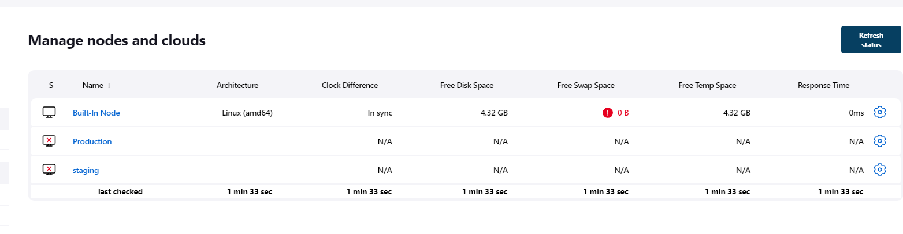

We shall need 3 servers

### 1. Let us launch 3 EC2 Instances


- A staging server - Check and test
- A production server - main server
- A Jenkins server


### 2. Let us install Jenkins on our Jenkins instance

- SSH into our 3 instances
 
 

### Let's update the system package repository of each instance
 ```
sudo apt-get update
 ```

 ### Next we shall install Java on our jenkins,staging and production nodes. The slave machines will need java to connect to jenkins
 ```
sudo apt install openjdk-11-jdk -y
 ```

### 3. Install Jenkins
```
curl -fsSL https://pkg.jenkins.io/debian-stable/jenkins.io.key | sudo tee \
  /usr/share/keyrings/jenkins-keyring.asc > /dev/null
echo deb [signed-by=/usr/share/keyrings/jenkins-keyring.asc] \
  https://pkg.jenkins.io/debian-stable binary/ | sudo tee \
  /etc/apt/sources.list.d/jenkins.list > /dev/null

sudo apt-get update

sudo apt-get install jenkins
```
### 4. Check the jenkins installation status


### 5. Set up Jenkins. Open up port 8080 and go to browser at jenkinsserveripaddress:8080


### Retrieve the Jenkins default password

```
sudo cat /var/lib/jenkins/secrets/initialAdminPassword
```


We shall select install suggested plugins

Create first Admin user


### ADD SLAVE NODES TO JENKINS 
- We shall add slave nodes to Jenkins using JNLP connections/protocol

- Manage Jenkins
-- Configure global security
---- Set TCP ports for inbound agents to random

-- Manage Nodes and Clouds

We have one node so far.   Built in node. (Our Jenkins Node which is the master.)

---- Let us add new nodes for staging and production

SET THE FOLLOWING

Remote home directory:    /home/ubuntu/jenkins
Launch method:   Launch agent by connecting it to the controller/master


