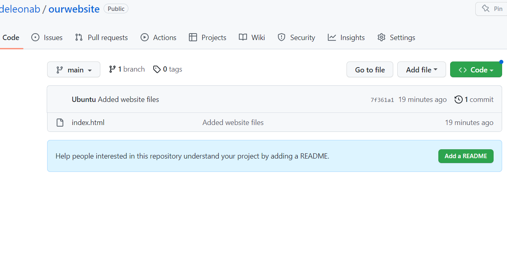
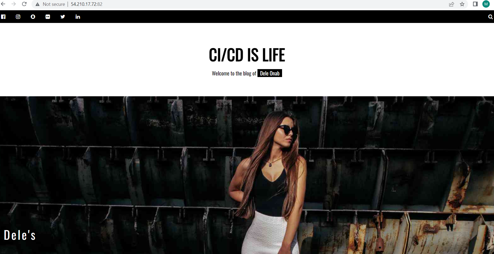

We shall need 3 servers

### 1. Let us launch 3 EC2 Instances


- A staging server - Check and test
- A production server - main server
- A Jenkins server


### 2. Let us install Jenkins on our Jenkins instance

- SSH into our 3 instances
 
 

### Let's update the system package repository of each instance
 ```
sudo apt-get update
 ```

 ### Next we shall install Java on our jenkins,staging and production nodes. The slave machines will need java to connect to jenkins
 ```
sudo apt install openjdk-11-jdk -y
 ```

### 3. Install Jenkins
```
curl -fsSL https://pkg.jenkins.io/debian-stable/jenkins.io.key | sudo tee \
  /usr/share/keyrings/jenkins-keyring.asc > /dev/null
echo deb [signed-by=/usr/share/keyrings/jenkins-keyring.asc] \
  https://pkg.jenkins.io/debian-stable binary/ | sudo tee \
  /etc/apt/sources.list.d/jenkins.list > /dev/null

sudo apt-get update

sudo apt-get install jenkins
```
### 4. Check the jenkins installation status

```
sudo systemctl status jenkins
```


### 5. Set up Jenkins. Open up port 8080 and go to browser at jenkinsserveripaddress:8080


### Retrieve the Jenkins default password

```
sudo cat /var/lib/jenkins/secrets/initialAdminPassword
```


We shall select install suggested plugins

Create first Admin user


### ADD SLAVE NODES TO JENKINS 
- We shall add slave nodes to Jenkins using JNLP connections/protocol

- Manage Jenkins
-- Configure global security
---- Set TCP ports for inbound agents to random

-- Manage Nodes and Clouds

We have one node so far.   Built in node. (Our Jenkins Node which is the master.)

---- Let us add new nodes for staging and production

### SET THE FOLLOWING for both slave nodes

Remote home directory:    /home/ubuntu/jenkins

Launch method:   Launch agent by connecting it to the controller/master


Our slave nodes are marked as red above as they are unconnected 

We will need to get the connection code from each Jenkins slave node to run on our servers and enable the connection.

Let us run the above code from the command line for the staging and production instances
```
curl -sO http://3.236.127.45:8080/jnlpJars/agent.jar

java -jar agent.jar -jnlpUrl http://3.236.127.45:8080/manage/computer/Production/jenkins-agent.jnlp -secret 1bcc07b3adab01e2c33eb0131ef9d7b176f39292b049243ca464140640188b3b -workDir "/home/ubuntu/jenkins"
```

#### Nodes are now connected


### Now that our nodes are connected, we can start creating a pipeline

### We shall copy a git repo to the slaves filesystem with Jenkins (Jenkins master)

### The website we shall be deploying will be containerized with docker using Jenkins

1. Pull source code from Git. Download in docker repository
2. Containerise code into Apache container
3. Test code
4. If successful, push to production


## OUR FIRST JOB - GIT JOB

- Select New Item

-- I will call it Git Job (for simplicity)
-- Choose Freestyle Project

-- From our terminal I will create a Git Repository called Ourwebsite and push website code to our remote Git repo.
```
mkdir website
```
```
cd website

sudo vi index.html
```

```
<!doctype html>
<html>
  <head>
    <title>Jenkins CI/CD Pipeline with Dele!</title>
  </head>
  <body>
    <p>This is a pipeline that uses Git, Docker and Jenkins. CI/CD is sich a <strong>beautiful thing.</strong> Reduce as much human error with <strong>automation.</strong> </p>
  </body>
</html>
```

```
git init

git add .

git branch -M main

git remote add origin https://github.com/deleonab/ourwebsite.git

git commit -m "Added website files"

git push origin main
```



We shall now copy the repo link and continue our Jenkins configuration.


Sourcecode Management: Git

Repository url:  https://github.com/deleonab/ourwebsite.git

Branch specifier: */main

Build Triggers: checkbox select Github hook trigger for gitSCM polling

Restrict where job can be run: staging


### The Git Job is done for now

Install Docker on both slaves(staging and production)
```
sudo apt-get install docker.io
```

### Now we need to create a Dockerfile with which Jenkins will build our image

```
sudo vi Dockerfile
```
#### Download Apache image and add to html directory
```
FROM hshar/webapp
ADD . /var/www/html

```

### The docker file must also be commited and pushed to our Git repo

```

git add .

git commit -m "Added Dockerfile to git"

git push origin main

```


#### Let's create another Jenkins job


-- Let's create another freestyle project and name it build-Website

- Restrict execution to staging

- Click Add build step 

- Select Execute shell option


#### IF CONNECTION IS LOST BECAUSE OF TIMEOUT
- Jenkins instance: 
```
ssh -i "jenkins.pem" ubuntu@ec2-3-236-127-45.compute-1.amazonaws.com

```

- Staging Instance: 
```
ssh -i "jenkins.pem" ubuntu@ec2-3-237-255-28.compute-1.amazonaws.com

curl -sO http://52.91.151.61:8080/jnlpJars/agent.jar
java -jar agent.jar -jnlpUrl http://52.91.151.61:8080/manage/computer/production/jenkins-agent.jnlp -secret 31399dd628f76d73f982424be393b104b50b0fb9f596e98916b67d42e3b84393 -workDir "/home/ubuntu/jenkins"
```
- Production Instance

```
ssh -i "jenkins.pem" ubuntu@ec2-44-199-249-135.compute-1.amazonaws.com

curl -sO http://3.236.127.45:8080/jnlpJars/agent.jar
java -jar agent.jar -jnlpUrl http://3.236.127.45:8080/manage/computer/Production/jenkins-agent.jnlp -secret 1bcc07b3adab01e2c33eb0131ef9d7b176f39292b049243ca464140640188b3b -workDir "/home/ubuntu/jenkins"
```


```
sudo docker rm -f %(sudo docker ps -a -f)  ### This failed when run
```
```
sudo docker rm -f %(sudo docker ps -a -q) ### This was successful and deleted all containers
```
### Let's test to make sure that our staging server can build containers. Our Jenkins build will delete all containers before it builds.

```
ubuntu@ip-172-31-15-53:~/jenkins$ cd workspace/
ubuntu@ip-172-31-15-53:~/jenkins/workspace$ ls
'Git Job'
ubuntu@ip-172-31-15-53:~/jenkins/workspace$ cd Git\ Job/
ubuntu@ip-172-31-15-53:~/jenkins/workspace/Git Job$ ls
Dockerfile  index.html  test1
ubuntu@ip-172-31-15-53:~/jenkins/workspace/Git Job$ pwd
/home/ubuntu/jenkins/workspace/Git Job
ubuntu@ip-172-31-15-53:~/jenkins/workspace/Git Job$ sudo docker run -it -d ubuntu
Unable to find image 'ubuntu:latest' locally
latest: Pulling from library/ubuntu
677076032cca: Pull complete
Digest: sha256:9a0bdde4188b896a372804be2384015e90e3f84906b750c1a53539b585fbbe7f
Status: Downloaded newer image for ubuntu:latest
84fc347d30d1c819b16386d73544869651af064dadbf96188052f20d6870ba52
ubuntu@ip-172-31-15-53:~/jenkins/workspace/Git Job$
```

### Ubuntu container was successfully built so we know our server can run docker successfully

### Now let us run the Build Website job in Jenkins

Note : Ensure that the build path in Jenkins is the same path as our Git Job path on out slave(staging)


```
sudo docker rm -f $(sudo docker ps -a -q)
sudo docker build /home/ubuntu/jenkins/workspace/Git_job -t website
sudo docker run -it -p 82:80 -d website
```
#### Let us build the Git_job
Result: Built successfully

#### Let us build the build_website job
Result: Built successfully


#### We can see our deployment on the staging server in our browser

```
stagingserverpublicIP:82

http://54.210.17.72:82/
```

###################

Web page here

#################


#### All works but we don't yet have a pipeline.

#### What we have now is the individual jobs that can be built manually


#### Now, we need to reconfigure out Git_job.

 - Go to post build actions and select build other project
 - We will also select the trigger only if build is stable option.

 

 #### At this stage, Git_job will trigger build_website.
 We now have to make git trigger build job by using web hook actions

 - Let's go to our Github website project > settings > webhook

 - set payload url to jenkins tool

 ```
 http://52.91.151.61:8080/github-webhook/
 ```

 

 #### Ensure that the webhook is showing a green tick of success

 

#### The next step was to make a change to the index.html file and push it to git.

```
sudo vi index.html
```

I edited the file by changing the title and name from Jane Doe to Dele Onabowu and pushed it.

The push triggered the github action which triggered the Git_)job in jenkins which triggered the build_website job to build and deploy our container.

The website was also updated in the browser.




#### The final stage of our pipeline is to push to production

- Let's start another Jenkins job called deploy_prod to deploy our website in production


#### Add build step > Execute shell

```
sudo docker rm -f $(sudo docker ps -a -q)
sudo docker build /home/ubuntu/jenkins/workspace/deploy_prod -t website
sudo docker run -it -p 82:80 -d website
```


This job will be triggered by the build_website job and will only fire if the build on staging is successful.

#### We shall now go into Build_website configuration to set up the post build actions.

- Go to build_website job


